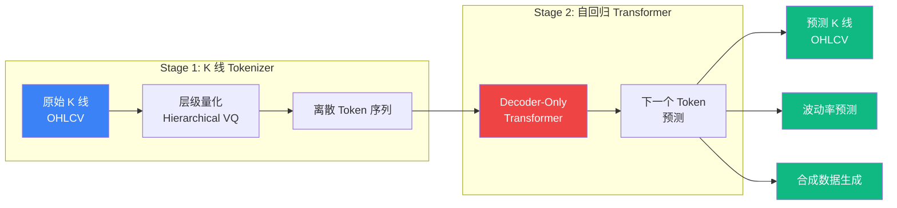

# 📈 Kronos 中文实战指南 — A 股 K 线预测

**首个金融 K 线基础模型，预训练于 45 个全球交易所、120 亿条 K 线数据。零样本预测 RankIC 比最强 TSFM 高 93%。**

[](https://arxiv.org/abs/2508.02739)
[](https://github.com/shiyu-coder/Kronos)
[](https://arxiv.org/abs/2508.02739)
[](https://huggingface.co/NeoQuasar)
[](https://github.com/shiyu-coder/Kronos/blob/master/LICENSE)

> **全网首份中文实战指南** | 原始项目：[GitHub (15.6k⭐)](https://github.com/shiyu-coder/Kronos) | 论文：[arXiv 2508.02739](https://arxiv.org/abs/2508.02739) | [Live Demo](https://shiyu-coder.github.io/Kronos-demo/)

---

## 📖 目录

- [为什么你该关注 Kronos](#-为什么你该关注-kronos)
- [架构解读](#-架构解读)
- [模型家族](#-模型家族)
- [环境搭建](#-环境搭建)
- [A 股数据获取与预处理](#-a-股数据获取与预处理)
- [预测实战](#-预测实战)
- [微调教程](#-微调教程)
- [回测集成](#-回测集成)
- [模型对比](#-模型对比)
- [FAQ 常见问题](#-faq-常见问题)
- [引用](#-引用)

---

## 🔥 为什么你该关注 Kronos

| 你现在用的 | Kronos 的优势 |
|-----------|-------------|
| LSTM/GRU 预测股价 | Kronos 是**基础模型**，预训练于 120 亿条 K 线，零样本即可用 |
| 通用时序模型（TimesFM 等） | Kronos **专为金融 K 线设计**，理解 OHLCV 结构 |
| 技术指标（MACD/KDJ/RSI） | Kronos 直接从原始 K 线学习，不依赖手工特征 |
| 量化因子挖掘 | Kronos 的预测信号可作为**新的 alpha 因子** |

### 核心指标（来自论文）

| 指标 | Kronos vs 最强 TSFM | Kronos vs 最强非预训练 |
|------|--------------------|--------------------|
| 价格预测 RankIC | **+93%** | **+87%** |
| 波动率预测 MAE | **-9%** | — |
| 合成 K 线保真度 | **+22%** | — |

**一句话：Kronos 是目前金融 K 线领域最强的开源基础模型，AAAI 2026 录用。**

---

## 🧠 架构解读

### 整体框架



### 两阶段设计

#### Stage 1: K 线 Tokenizer（关键创新）

金融 K 线不是普通时序数据——每根 K 线包含 **6 个维度**（开盘、最高、最低、收盘、成交量、成交额），且噪声极大。

Kronos 的 Tokenizer 用**层级向量量化（Hierarchical VQ）**将连续的 K 线数据离散化：

```
原始 K 线 [O, H, L, C, V, A]
    ↓ 归一化（相对前一根 K 线的变化率）
变化率向量 [ΔO, ΔH, ΔL, ΔC, ΔV, ΔA]
    ↓ 层级量化
      ├─ 粗粒度 Token（捕捉大趋势：涨/跌/震荡）
      └─ 细粒度 Token（捕捉精确幅度）
    ↓
离散 Token ID（如同 "K 线语言" 的词汇）
```

**为什么这样设计？**
- 将连续浮点数转为离散 token → 可以用 LLM 的自回归范式
- 层级量化 → 粗粒度捕捉趋势，细粒度保留精度
- 相对变化率 → 不同价位的股票可以共享同一套 token 词表

#### Stage 2: 自回归 Transformer

标准的 Decoder-Only Transformer（类似 GPT），在 Token 序列上做 next-token prediction：

- 输入：历史 K 线的 Token 序列
- 输出：下一根 K 线的 Token
- 采样：支持 Temperature + Top-p 核采样 → 概率性预测

### 预训练数据

| 维度 | 规模 |
|------|------|
| 交易所 | 45 个全球交易所 |
| K 线条数 | **120 亿+** |
| 时间跨度 | 多年历史 |
| 资产类型 | 股票、加密货币、期货、外汇 |
| 时间频率 | 1min / 5min / 15min / 1h / 日线 |

---

## 📦 模型家族

| 模型 | Tokenizer | 上下文长度 | 参数量 | 推荐场景 | HuggingFace |
|------|-----------|-----------|--------|---------|-------------|
| **Kronos-mini** | Tokenizer-2k | 2048 | 4.1M | 🟢 入门体验、快速验证 | [下载](https://huggingface.co/NeoQuasar/Kronos-mini) |
| **Kronos-small** | Tokenizer-base | 512 | 24.7M | 🟡 日常研究、A 股预测 | [下载](https://huggingface.co/NeoQuasar/Kronos-small) |
| **Kronos-base** | Tokenizer-base | 512 | 102.3M | 🔴 高精度预测、微调 | [下载](https://huggingface.co/NeoQuasar/Kronos-base) |
| **Kronos-large** | Tokenizer-base | 512 | 499.2M | ⚫ 最高精度（未开源） | ❌ |

> 💡 **推荐**：A 股日线预测用 **Kronos-small**（24.7M 参数，笔记本可跑）；需要高精度用 **Kronos-base**。

### 上下文长度说明

- **Kronos-mini** 支持最长 2048 根 K 线（约 2048 根 5 分钟线 ≈ 7 个交易日）
- **Kronos-small/base** 支持最长 512 根 K 线（约 512 根日线 ≈ 2 年历史）
- 输入超过上下文长度时会自动截断，**建议不要超过 max_context**

---

## 🛠️ 环境搭建

### 基础安装

```bash
# 推荐 Python 3.10+，PyTorch 2.0+
conda create -n kronos python=3.10
conda activate kronos

# 克隆 Kronos
git clone https://github.com/shiyu-coder/Kronos.git
cd Kronos

# 安装依赖（国内镜像加速）
pip install -r requirements.txt -i https://pypi.tuna.tsinghua.edu.cn/simple
```

### HuggingFace 下载加速（国内必看）

```bash
# 方法 1: 使用 hf-mirror（推荐）
export HF_ENDPOINT=https://hf-mirror.com
python -c "
from model import Kronos, KronosTokenizer
tokenizer = KronosTokenizer.from_pretrained('NeoQuasar/Kronos-Tokenizer-base')
model = Kronos.from_pretrained('NeoQuasar/Kronos-small')
print('✅ 下载完成')
"

# 方法 2: 手动下载
pip install huggingface_hub -i https://pypi.tuna.tsinghua.edu.cn/simple
export HF_ENDPOINT=https://hf-mirror.com
huggingface-cli download NeoQuasar/Kronos-small --local-dir ./models/kronos-small
huggingface-cli download NeoQuasar/Kronos-Tokenizer-base --local-dir ./models/tokenizer-base
```

### A 股数据源安装

```bash
# Tushare（需注册获取 token，https://tushare.pro）
pip install tushare -i https://pypi.tuna.tsinghua.edu.cn/simple

# AKShare（免费，无需注册）
pip install akshare -i https://pypi.tuna.tsinghua.edu.cn/simple

# Baostock（免费，沪深数据）
pip install baostock -i https://pypi.tuna.tsinghua.edu.cn/simple

# Qlib（微软出品，微调必须）
pip install pyqlib -i https://pypi.tuna.tsinghua.edu.cn/simple
```

---

## 📊 A 股数据获取与预处理

### 方案 1: AKShare（免费，推荐入门）

```python
import akshare as ak
import pandas as pd

def get_a_share_kline(symbol: str, period: str = "daily", start: str = "20230101") -> pd.DataFrame:
    """
    获取 A 股 K 线数据并转为 Kronos 格式
    
    Args:
        symbol: 股票代码，如 "600519"（贵州茅台）
        period: "daily" / "weekly" / "monthly"
        start: 开始日期
    
    Returns:
        Kronos 格式的 DataFrame
    """
    # AKShare 获取数据
    df = ak.stock_zh_a_hist(symbol=symbol, period=period, start_date=start, adjust="qfq")
    
    # 转为 Kronos 格式
    kronos_df = pd.DataFrame({
        'timestamps': pd.to_datetime(df['日期']),
        'open': df['开盘'].astype(float),
        'high': df['最高'].astype(float),
        'low': df['最低'].astype(float),
        'close': df['收盘'].astype(float),
        'volume': df['成交量'].astype(float),
        'amount': df['成交额'].astype(float),
    })
    
    return kronos_df

# 使用示例
df = get_a_share_kline("600519")  # 贵州茅台
print(f"获取到 {len(df)} 根 K 线")
print(df.tail())
```

### 方案 2: Tushare（更全面，需注册）

```python
import tushare as ts
import pandas as pd

# 设置 token（在 https://tushare.pro 注册获取）
ts.set_token("YOUR_TUSHARE_TOKEN")
pro = ts.pro_api()

def get_tushare_kline(ts_code: str, start: str = "20230101") -> pd.DataFrame:
    """
    获取 A 股日线数据
    
    Args:
        ts_code: Tushare 股票代码，如 "600519.SH"
        start: 开始日期
    """
    df = pro.daily(ts_code=ts_code, start_date=start)
    df = df.sort_values('trade_date').reset_index(drop=True)
    
    kronos_df = pd.DataFrame({
        'timestamps': pd.to_datetime(df['trade_date']),
        'open': df['open'].astype(float),
        'high': df['high'].astype(float),
        'low': df['low'].astype(float),
        'close': df['close'].astype(float),
        'volume': df['vol'].astype(float) * 100,  # Tushare 单位是手
        'amount': df['amount'].astype(float) * 1000,  # Tushare 单位是千元
    })
    
    return kronos_df

# 使用示例
df = get_tushare_kline("600519.SH")
```

### 方案 3: Baostock（免费，无需注册）

```python
import baostock as bs
import pandas as pd

def get_baostock_kline(code: str, start: str = "2023-01-01") -> pd.DataFrame:
    """
    获取沪深 A 股 K 线（Baostock 格式）
    
    Args:
        code: 股票代码，如 "sh.600519"
    """
    bs.login()
    rs = bs.query_history_k_data_plus(
        code, "date,open,high,low,close,volume,amount",
        start_date=start, frequency="d", adjustflag="2"  # 前复权
    )
    
    rows = []
    while rs.next():
        rows.append(rs.get_row_data())
    bs.logout()
    
    df = pd.DataFrame(rows, columns=rs.fields)
    kronos_df = pd.DataFrame({
        'timestamps': pd.to_datetime(df['date']),
        'open': df['open'].astype(float),
        'high': df['high'].astype(float),
        'low': df['low'].astype(float),
        'close': df['close'].astype(float),
        'volume': df['volume'].astype(float),
        'amount': df['amount'].astype(float),
    })
    
    return kronos_df

# 使用示例
df = get_baostock_kline("sh.600519")
```

### 数据源对比

| 数据源 | 注册 | 日线 | 分钟线 | 实时行情 | 限频 | 推荐 |
|--------|------|------|--------|---------|------|------|
| **AKShare** | 不需要 | ✅ | ✅ | ✅ | 宽松 | ⭐ 入门首选 |
| **Tushare** | 需要（免费） | ✅ | ✅（积分制） | ✅ | 严格 | ⭐ 专业用户 |
| **Baostock** | 不需要 | ✅ | ✅（5min） | ❌ | 宽松 | 研究用 |
| **Qlib** | 不需要 | ✅ | ❌ | ❌ | — | 微调必须 |

---

## 🎯 预测实战

### 案例 1: BTC/USDT 预测（官方示例）

```python
from model import Kronos, KronosTokenizer, KronosPredictor
import pandas as pd

# 加载模型
tokenizer = KronosTokenizer.from_pretrained("NeoQuasar/Kronos-Tokenizer-base")
model = Kronos.from_pretrained("NeoQuasar/Kronos-small")
predictor = KronosPredictor(model, tokenizer, max_context=512)

# 加载 BTC 数据（项目自带）
df = pd.read_csv("./data/XSHG_5min_600977.csv")
df['timestamps'] = pd.to_datetime(df['timestamps'])

# 定义时间窗口
lookback = 400   # 用 400 根 K 线作为输入
pred_len = 120   # 预测未来 120 根 K 线

x_df = df.loc[:lookback-1, ['open', 'high', 'low', 'close', 'volume', 'amount']]
x_timestamp = df.loc[:lookback-1, 'timestamps']
y_timestamp = df.loc[lookback:lookback+pred_len-1, 'timestamps']

# 预测
pred_df = predictor.predict(
    df=x_df,
    x_timestamp=x_timestamp,
    y_timestamp=y_timestamp,
    pred_len=pred_len,
    T=1.0,        # 温度（越高越随机）
    top_p=0.9,    # 核采样概率
    sample_count=1 # 采样次数（多次取平均可提高稳定性）
)

print(pred_df.head())
```

### 案例 2: A 股预测（贵州茅台 600519）

```python
from model import Kronos, KronosTokenizer, KronosPredictor
import pandas as pd
import akshare as ak

# 1. 加载模型
tokenizer = KronosTokenizer.from_pretrained("NeoQuasar/Kronos-Tokenizer-base")
model = Kronos.from_pretrained("NeoQuasar/Kronos-small")
predictor = KronosPredictor(model, tokenizer, max_context=512)

# 2. 获取 A 股数据
raw = ak.stock_zh_a_hist(symbol="600519", period="daily", start_date="20240101", adjust="qfq")
df = pd.DataFrame({
    'timestamps': pd.to_datetime(raw['日期']),
    'open': raw['开盘'].astype(float),
    'high': raw['最高'].astype(float),
    'low': raw['最低'].astype(float),
    'close': raw['收盘'].astype(float),
    'volume': raw['成交量'].astype(float),
    'amount': raw['成交额'].astype(float),
}).reset_index(drop=True)

# 3. 准备输入
lookback = min(400, len(df) - 30)  # 留 30 根做验证
pred_len = 30

x_df = df.loc[:lookback-1, ['open', 'high', 'low', 'close', 'volume', 'amount']]
x_timestamp = df.loc[:lookback-1, 'timestamps']
y_timestamp = df.loc[lookback:lookback+pred_len-1, 'timestamps']

# 4. 预测
pred_df = predictor.predict(
    df=x_df,
    x_timestamp=x_timestamp,
    y_timestamp=y_timestamp,
    pred_len=pred_len,
    T=0.8,         # 稍低温度，预测更确定性
    top_p=0.85,
    sample_count=5  # 5 次采样取平均，更稳定
)

# 5. 对比真实值
actual = df.loc[lookback:lookback+pred_len-1, ['open', 'high', 'low', 'close']].reset_index(drop=True)
print("预测值:")
print(pred_df[['open', 'high', 'low', 'close']].head())
print("\n实际值:")
print(actual.head())

# 6. 计算方向准确率
pred_direction = (pred_df['close'].values[1:] > pred_df['close'].values[:-1]).astype(int)
actual_direction = (actual['close'].values[1:] > actual['close'].values[:-1]).astype(int)
accuracy = (pred_direction == actual_direction).mean()
print(f"\n涨跌方向准确率: {accuracy:.2%}")
```

### 案例 3: 批量预测多只股票

```python
# 同时预测多只 A 股
symbols = ["600519", "000858", "601318", "600036", "000001"]
names = ["贵州茅台", "五粮液", "中国平安", "招商银行", "平安银行"]

df_list, x_ts_list, y_ts_list = [], [], []

for symbol in symbols:
    raw = ak.stock_zh_a_hist(symbol=symbol, period="daily", start_date="20240101", adjust="qfq")
    df = pd.DataFrame({
        'timestamps': pd.to_datetime(raw['日期']),
        'open': raw['开盘'].astype(float), 'high': raw['最高'].astype(float),
        'low': raw['最低'].astype(float), 'close': raw['收盘'].astype(float),
        'volume': raw['成交量'].astype(float), 'amount': raw['成交额'].astype(float),
    }).reset_index(drop=True)
    
    lookback = min(400, len(df) - 30)
    df_list.append(df.loc[:lookback-1, ['open', 'high', 'low', 'close', 'volume', 'amount']])
    x_ts_list.append(df.loc[:lookback-1, 'timestamps'])
    y_ts_list.append(df.loc[lookback:lookback+29, 'timestamps'])

# 批量预测（GPU 并行）
pred_list = predictor.predict_batch(
    df_list=df_list,
    x_timestamp_list=x_ts_list,
    y_timestamp_list=y_ts_list,
    pred_len=30, T=0.8, top_p=0.85, sample_count=5, verbose=True
)

for name, pred in zip(names, pred_list):
    trend = "📈" if pred['close'].iloc[-1] > pred['close'].iloc[0] else "📉"
    print(f"{trend} {name}: 预测 30 日后收盘价 {pred['close'].iloc[-1]:.2f}")
```

### 预测参数调优指南

| 参数 | 作用 | 推荐值 | 说明 |
|------|------|--------|------|
| `T` (Temperature) | 控制随机性 | 0.7-1.0 | 越低越确定、越高越多样 |
| `top_p` | 核采样 | 0.8-0.95 | 过滤低概率 token |
| `sample_count` | 采样次数 | 3-10 | 多次采样取平均更稳定 |
| `lookback` | 历史窗口 | 200-500 | 不超过 max_context |
| `pred_len` | 预测长度 | 5-120 | 越短越准 |

> 💡 **A 股建议**：`T=0.8, top_p=0.85, sample_count=5`。A 股噪声大，适当降低温度 + 多次采样。

---

## 🔧 微调教程

### 为什么要微调？

Kronos 预训练于全球 45 个交易所的数据，但 **A 股有其独特性**：
- 涨跌停板制度（10%/20%）
- T+1 交易制度
- 散户比例高，短期波动大
- 特有的行业板块轮动

**微调可以让 Kronos 更适应 A 股市场。**

### 微调流程（使用 Qlib 数据）

#### Step 1: 准备 Qlib 数据

```bash
# 下载 A 股日线数据
python -m qlib.run.get_data qlib_data --target_dir ~/.qlib/qlib_data/cn_data --region cn

# 验证数据
python -c "
import qlib
qlib.init(provider_uri='~/.qlib/qlib_data/cn_data')
from qlib.data import D
df = D.features(['SH600519'], ['$open', '$high', '$low', '$close', '$volume'], 
                start_time='2024-01-01')
print(df.tail())
"
```

#### Step 2: 修改配置文件

编辑 `finetune/config.py`：

```python
# === 数据路径 ===
qlib_data_path = "~/.qlib/qlib_data/cn_data"  # Qlib 数据目录
dataset_path = "./finetune_data"                # 处理后数据保存路径

# === 训练参数 ===
instrument = "csi300"                           # 沪深 300 成分股
train_time_range = ("2018-01-01", "2024-06-30") # 训练区间
valid_time_range = ("2024-07-01", "2024-12-31") # 验证区间
test_time_range = ("2025-01-01", "2025-06-30")  # 测试区间

# === 模型路径 ===
pretrained_tokenizer_path = "NeoQuasar/Kronos-Tokenizer-base"
pretrained_predictor_path = "NeoQuasar/Kronos-small"  # 或 Kronos-base

# === 训练超参 ===
epochs = 10
batch_size = 32
learning_rate = 1e-4
use_comet = False  # 不用 Comet.ml 可以关掉
```

#### Step 3: 数据预处理

```bash
python finetune/qlib_data_preprocess.py
# 输出: finetune_data/train_data.pkl, val_data.pkl, test_data.pkl
```

#### Step 4: 两阶段微调

```bash
# Stage 1: 微调 Tokenizer（适应 A 股数据分布）
torchrun --standalone --nproc_per_node=1 finetune/train_tokenizer.py
# 单卡用 nproc_per_node=1，多卡改为 GPU 数量

# Stage 2: 微调 Predictor（提升预测精度）
torchrun --standalone --nproc_per_node=1 finetune/train_predictor.py
```

#### Step 5: 回测验证

```bash
python finetune/qlib_test.py --device cuda:0
# 输出：策略收益率曲线 + 详细指标
```

### 微调硬件需求

| 模型 | 最小 GPU | 推荐 GPU | 训练时间（CSI300） |
|------|---------|---------|-------------------|
| Kronos-mini (4.1M) | 4GB | RTX 3060 | ~30 分钟 |
| Kronos-small (24.7M) | 8GB | RTX 4060 | ~2 小时 |
| Kronos-base (102.3M) | 16GB | RTX 4090 | ~8 小时 |

---

## 📈 回测集成

### 与 Backtrader 集成

```python
import backtrader as bt
import pandas as pd
from model import Kronos, KronosTokenizer, KronosPredictor

class KronosStrategy(bt.Strategy):
    """基于 Kronos 预测信号的交易策略"""
    
    params = (
        ('lookback', 200),
        ('pred_len', 5),
        ('threshold', 0.01),  # 预测涨幅 > 1% 才买入
    )
    
    def __init__(self):
        # 加载 Kronos
        tokenizer = KronosTokenizer.from_pretrained("NeoQuasar/Kronos-Tokenizer-base")
        model = Kronos.from_pretrained("NeoQuasar/Kronos-small")
        self.predictor = KronosPredictor(model, tokenizer, max_context=512)
        self.order = None
    
    def next(self):
        if self.order:
            return
        
        # 每 5 个交易日预测一次
        if len(self) % 5 != 0 or len(self) < self.p.lookback:
            return
        
        # 准备数据
        data = pd.DataFrame({
            'open': [self.data.open[-i] for i in range(self.p.lookback-1, -1, -1)],
            'high': [self.data.high[-i] for i in range(self.p.lookback-1, -1, -1)],
            'low': [self.data.low[-i] for i in range(self.p.lookback-1, -1, -1)],
            'close': [self.data.close[-i] for i in range(self.p.lookback-1, -1, -1)],
        })
        
        x_ts = pd.Series(pd.date_range(end=pd.Timestamp.now(), periods=self.p.lookback, freq='D'))
        y_ts = pd.Series(pd.date_range(start=pd.Timestamp.now(), periods=self.p.pred_len, freq='D'))
        
        # Kronos 预测
        pred = self.predictor.predict(
            df=data, x_timestamp=x_ts, y_timestamp=y_ts,
            pred_len=self.p.pred_len, T=0.8, top_p=0.85, sample_count=5
        )
        
        # 交易信号
        predicted_return = (pred['close'].iloc[-1] - data['close'].iloc[-1]) / data['close'].iloc[-1]
        
        if predicted_return > self.p.threshold and not self.position:
            self.order = self.buy()
        elif predicted_return < -self.p.threshold and self.position:
            self.order = self.sell()

# 运行回测
cerebro = bt.Cerebro()
cerebro.addstrategy(KronosStrategy)
# ... 添加数据和资金设置
cerebro.run()
cerebro.plot()
```

> ⚠️ **免责声明**：以上代码仅为技术演示，不构成投资建议。实际量化策略需要更完善的风控、仓位管理和因子中性化。

---

## 🆚 模型对比

### Kronos vs 其他时序基础模型

| 模型 | 类型 | 金融特化 | K 线理解 | 零样本能力 | 开源 | 推荐度 |
|------|------|---------|---------|-----------|------|--------|
| **Kronos** | K 线基础模型 | ✅ 专为金融设计 | ✅ OHLCV 原生 | ⭐⭐⭐⭐⭐ | ✅ | 🏆 |
| TimesFM | 通用时序 | ❌ | ❌ 仅单变量 | ⭐⭐⭐ | ✅ | ⭐⭐⭐ |
| Lag-Llama | 通用时序 | ❌ | ❌ 仅单变量 | ⭐⭐⭐ | ✅ | ⭐⭐⭐ |
| Chronos | 通用时序 | ❌ | ❌ 仅单变量 | ⭐⭐⭐ | ✅ | ⭐⭐⭐ |
| MOMENT | 通用时序 | ❌ | ❌ | ⭐⭐ | ✅ | ⭐⭐ |
| Timer | 通用时序 | 部分 | ❌ | ⭐⭐ | ✅ | ⭐⭐ |

### 关键差异

| 维度 | 通用 TSFM | Kronos |
|------|----------|--------|
| 输入格式 | 单变量/多变量时序 | **原生 OHLCV K 线** |
| Tokenization | 连续值分桶/patch | **层级 VQ 离散化** |
| 预训练数据 | 通用时序数据集 | **120 亿条 K 线** |
| 输出 | 数值预测 | **K 线预测 + 波动率 + 合成** |
| 金融噪声处理 | 无特殊处理 | **相对变化率 + 层级量化** |

---

## ❓ FAQ 常见问题

### Q1: Kronos 能直接用来炒股赚钱吗？

**不能直接用。** Kronos 的预测信号是**原始信号**，在实际交易中需要：
1. 因子中性化（排除市场/行业 beta）
2. 组合优化（不是买单只股票）
3. 风控系统（止损、仓位管理）
4. 交易成本（手续费、冲击成本、滑点）

Kronos 的正确用法是：**作为量化策略中的一个因子/信号源**。

### Q2: 用日线还是分钟线好？

| 频率 | 优点 | 缺点 | 推荐场景 |
|------|------|------|---------|
| **日线** | 数据易获取，噪声较低 | 信号慢 | 中长线策略 |
| **5 分钟线** | 信号快，更精细 | 噪声大，数据量大 | 日内/短线策略 |
| **1 小时线** | 折中方案 | — | 波段策略 |

> 💡 **入门推荐日线**，熟悉后再尝试分钟线。

### Q3: 只有收盘价数据（没有 Volume/Amount）能用吗？

**能！** Kronos 支持无量价数据的预测，参考官方示例：
```bash
python examples/prediction_wo_vol_example.py
```

### Q4: 预测结果和真实值差很远怎么办？

1. **检查数据是否前复权** — 未复权的数据在除权日会有跳空，影响模型
2. **增加 sample_count** — 多次采样取平均更稳定
3. **降低 Temperature** — `T=0.6~0.8` 让预测更确定
4. **增加 lookback** — 给模型更多历史信息（但不超过 max_context）
5. **微调** — 用 A 股数据微调后效果显著提升

### Q5: 港股/美股能用吗？

**能！** Kronos 预训练包含全球 45 个交易所的数据，港股和美股都在其中。数据获取：
- 港股：AKShare `ak.stock_hk_hist()`
- 美股：`yfinance` 库
- 加密货币：`ccxt` 库

### Q6: 微调时 OOM 怎么办？

```python
# 1. 减小 batch_size
batch_size = 16  # 改为 8 或更小

# 2. 用 Kronos-small 而不是 Kronos-base
pretrained_predictor_path = "NeoQuasar/Kronos-small"  # 24.7M vs 102.3M

# 3. 开启梯度累积
gradient_accumulation_steps = 4  # 等效 batch_size 翻 4 倍

# 4. 用 mixed precision
# 在 train_predictor.py 中确保使用 torch.cuda.amp
```

### Q7: 能用 CPU 跑推理吗？

**可以，但很慢。** Kronos-small (24.7M) 在 CPU 上推理一次约 10-30 秒，GPU 上约 0.5 秒。

```python
# CPU 推理
predictor = KronosPredictor(model, tokenizer, max_context=512)
# 模型默认会用 CPU，如果有 GPU 会自动切换
```

---

## 📝 引用

```bibtex
@inproceedings{shi2026kronos,
  title={Kronos: A Foundation Model for the Language of Financial Markets},
  author={Shi, Yu and others},
  booktitle={Proceedings of the AAAI Conference on Artificial Intelligence},
  year={2026}
}
```

---

## 🔗 相关资源

- [Kronos 原始仓库](https://github.com/shiyu-coder/Kronos)（15.6k⭐）
- [arXiv 论文](https://arxiv.org/abs/2508.02739)
- [HuggingFace 模型](https://huggingface.co/NeoQuasar)
- [Live Demo](https://shiyu-coder.github.io/Kronos-demo/)
- [Qlib 量化平台](https://github.com/microsoft/qlib)（微软出品）
- [AKShare 文档](https://akshare.akfamily.xyz/)
- [Tushare 官网](https://tushare.pro/)

---

## ⚠️ 免责声明

本指南仅为技术学习用途，不构成任何投资建议。金融市场存在风险，使用 AI 模型进行投资决策需自行承担风险。Kronos 的预测结果仅供参考，实际交易请结合专业的风控和合规要求。

---

## 🔗 更多中文 AI 实战指南

| 项目 | 简介 |
|------|------|
| [🤖 AI Agent 框架选型指南](https://github.com/Vincentwei1021/awesome-ai-agent-frameworks) | Scion/AutoGen/CrewAI/LangGraph 深度对比 + 选型决策树 |
| [🚀 MegaTrain 中文实战指南](https://github.com/Vincentwei1021/megatrain-guide-cn) | 单 GPU 训练 100B+ 大模型 · 硬件选购 · 性能对比 |

---

## 📄 许可证

本指南采用 [MIT License](LICENSE) 开源。Kronos 原始代码采用 [Apache 2.0 License](https://github.com/shiyu-coder/Kronos/blob/master/LICENSE)。

---

<p align="center">
  <b>⭐ 如果这份指南对你有帮助，请给一个 Star！</b><br/>
  <sub>有问题或建议？欢迎 <a href="https://github.com/Vincentwei1021/kronos-guide-cn/issues">提 Issue</a></sub>
</p>
